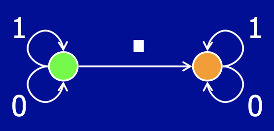
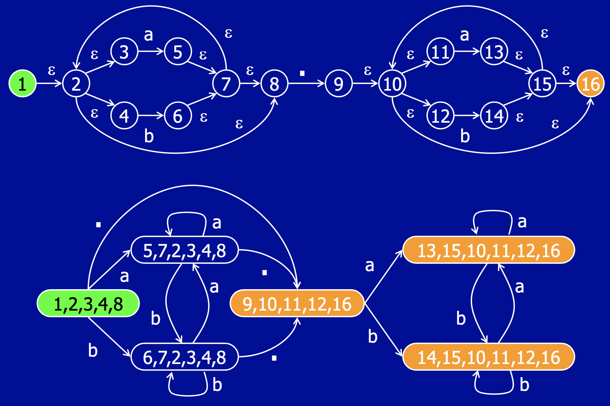
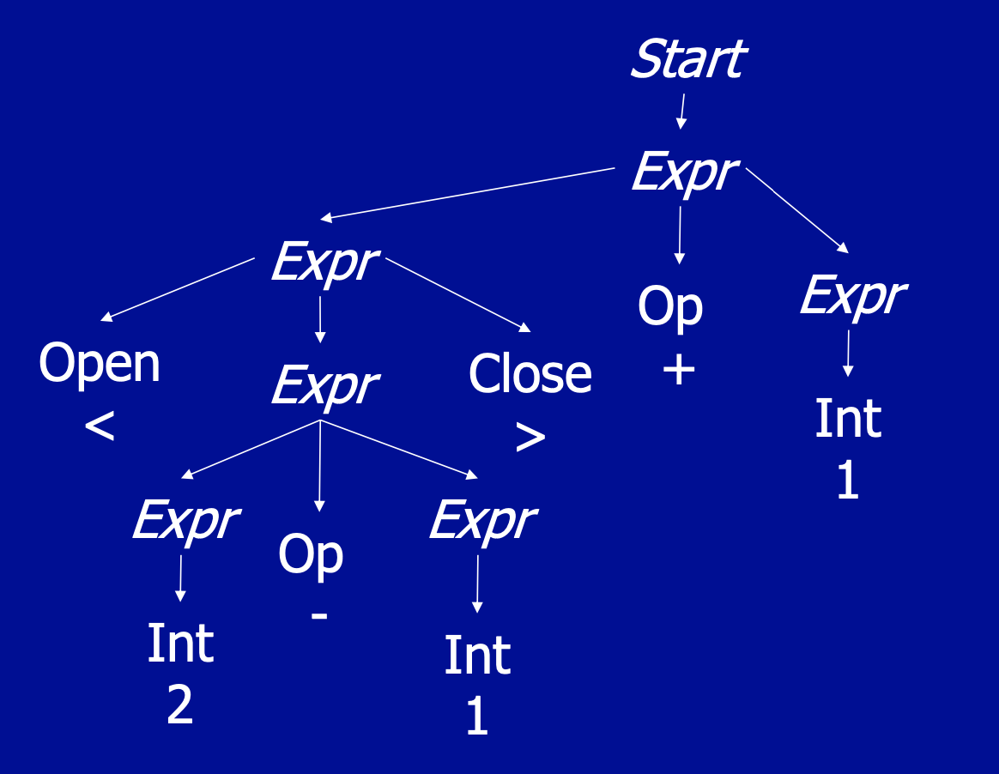

# 6.035 L2: Regular Expressions and Context-Free Grammars

## Defining a Language
Specifying a language formally was a huge triumph of theoretical CS with many practical applications.

Languages are defined in "layers":
* Lexical structure- identify the legal "words" in the language
* Syntactic structure- identify the legal "sentences", or groupings of words, in the language
* Semantics- meaning of program based on input

Two interconvertible Dual Notions:
* Generative approach (grammar | regular expression)
  * More useful for theoretical definition
* Recognition approach (automaton/ state machine)
  * More useful for practical implementation

## Lexical Structure
### Regular Expressions
Regular expressions (r.e) specify *lexical* structure using:
* alphabet $\Sigma$, or set of letters
* Starting sequences, which include:
  * $\epsilon$ = empty string
  * Any letter $l \in \Sigma$
  * Sequence: $r_1r_2$ denotes r.e. $r_1$ followed by $r_2$.
  * $r_1 | r_2$: either $r_1$ or $r_2$
  * $r^*$: iterated sequence and choice
  * Parentheses indicating grouping/ precedence
* Rewriting rules. From the starting sequence, we repeated apply these rules to rewrite the expression.
  * $r_1 | r_2 \to r_1$
  * $r_1 | r_2 \to r_2$
  * $r^* \to r r^*$
  * $r^* \to \epsilon$

It may seem strange that the same expression can be rewritten using multiple rules. This reflects the *generative* nature of r.e.'s: to prove a given final string belongs to the *language* of the starting expression, all we must do is that it is possible to generate the string from the r.e. 
* The language is the set of all strings generated from the regular expression, and may be countably infinite.

For example, the expression `(0|1)*.(0|1)*` is the language (generates all) of binary decimals. 

### Finite-State Automata
The recognition approach response to r.e.'s. 
* alphabet $\Sigma$
* Set of states with initial and accept states (these need not be distinct)
* Transitions between states labeled with letters.

The string is run through the machine starting at the start state. 
* At each step, match current letter against a transition, then take that transition and move onto the next letter. 
* Continue until end of string (commonly denoted as `$`)or match fails
* If in accept state when `$` is encountered, accept this string, otherwise reject it

Analogously, the set of strings the automaton accepts is the language of the automaton. See that the following automaton produces the same language as the r.e. `(0|1)*.(0|1)*`:

#### DFA vs NFA
Deterministic (D-) vs Nondeterministic (N-) Finite Automata (-FA)
* DFA's have only one possible (i.e. determined) transitions at each state
* NFA's may have multiple possible transitions, more than one transition per label, and transitions possibly labeled with empty string $\epsilon$ (which may be immediately taken without moving forward in the string)

As a rule, we have NFA's accept a string if *any possible execution* of the NFA accepts.
* This is called *angelic nondeterminism*- all decisions made to accept if possible.
* Contrast with *demonic nondeterminism*- all decisions made to reject

NFA's might seem more similar to the generative approach- in fact that is the point. We can show we can convert any r.e. into some NFA, which can be converted into a DFA!

We want to do this, since
* r.e.'s give a way to generate all strings in language- useful for *defining* a language
* Automata give a way to *recognize* if string is in language- thus useful for implementation
* Theoretically they are equivalent, which is very useful!

To prove r.e. equivalence to NFA's, we may use structural induction. Assume we can convert an arbitrary regular expression $r$ to a NFA with 1 start and accept state, we can show how to convert all r.e. constructors (the rewriting rules from above) to a NFA. This is in the slides.

Since it is computationally infeasible to try every execution path in a NFA for every string we want to verify, we want to convert NFA's to DFA's. 

The full algorithm is in the slides, but as a naive approach, we have a state in the DFA for everyone of $2^n$ subset of states in the NFA.
* DFA start state consists of the states reachable using empty transitions from start state in the NFA
* DFA state is accept state if NFA accept state is in subset of states
* For a given DFA state $D$ with subset $N$ of NFA states, and a letter $a$, then we find the subset of NFA states $N'$ that is reachable from any state in $N$ by transition on $a$. Then we add a transition from $D$ to DFA state $D'$ that corresponds to this subset $N'$.

Of course, in most realistic cases most of the DFA states go unused:

But this naive algorithm actually exposes the fact that even the best algorithms result in a worst case exponentially large DFA. Luckily, in practice, we may achieve close to linearly larger DFA's for many grammars.

### Lexical Structure in Languages
Every language has several categories of words, each defined by r.e.'s. 
* Keywords (if, while)
* Operations
* Integers/ Floating Point
* Identifiers, etc.

## Syntactic Structure
(Finite) r.e.'s cannot model most nested syntax, since they lack sufficient state information (see next lecture). 

Soln: 
### Context-Free Grammars
* Set of *terminals* which is defined/ maps to a regular expressions. Ex:
  * `OP = +|-|*|/`
  * `Int = [0-9][0-9]*`
  * `Open = (`
  * `Close = )`
* *Nonterminals* which expand using rewriting rules similar to r.e's
  * `Start`, `Expr`
* Rewriting rules (for ex, the language of this grammar is all parenthesized arithmetic expressions with integers):
  * `Start -> Expr`
  * `Expr -> Expr Op Expr`
  * `Expr -> Int`
  * `Expr -> Open Expr Close`

As you can see, grammars are part of the generative approach.

From a given expression, one can generate a *parse tree* that captures the derivation of the expression.
* Internal Nodes are nonterminals.
* Leaves are terminals.

Ex. Parse tree for `(2-1)+1`

### Syntactic Ambiguity
Consider the expression `2-1+1`. It is not too hard to see there are multiple derivations/ parse trees for this string. In this case there are 2, each corresponding to `(2-1)+1` and `2-(1+1)`. 

We can see that ambiguity is very bad just from this example, as it messes with the evaluated result.  

*Hacked grammars* can eliminate ambiguity by, intuitively keeping better track of state. 

#### Association Direction
For example, to make sure operators left associate, we can modify the rules:
  * `Start -> Expr`
  * `Expr -> Expr Op Int` <-- Here
  * `Expr -> Int`
  * `Expr -> Open Expr Close`

The only way to go more deeply nested (add parentheses) is to have an `Int` on the right, on the outside. Easy to see how to make operators right associate as well!

#### Precedence
Consider the classic PEMDAS: how does the expression `2-3*4` evaluate? Obviously, in general the multiplication operation can be on either side, so simply enforcing associativity no longer works. Conveniently, we may hack around precedence:
* Separate terminals into precedence levels:
  * `AddOp = +|-`
  * `MulOp = *|/`
* Add precedence levels for expressions:
  * `Expr -> Expr AddOp Term`
  * `Expr -> Term`
  * `Term -> Term MulOp Num`
  * `Term -> Num`
  * `Num -> Int`
  * `Num -> Open Expr Close`

Intuitively, what this does is that it forces `MulOp` to always bind most *strongly*- that is, closer to the terminal expression (whether that be a `Int` or a nested parenthesized expression `Open Expr Close`). Note how the rules ensure that if there is a `MulOp`, there must either be a `AddOp` in the level above it in the parse tree, or no operation at all. The only way for an `AddOp` to generate below a `MulOp`- that is, to have been generated within a `Term`- is to be in a parenthesized expression using `Num`.

This generalizes to arbitrary levels of precedence.

### Parser
You can create hacked grammars for more complex rules, such as the rules handling nested if/elses (see slides). 

The issue is that once we actually want to write a *parser* to convert a program into a parse tree, the greatly increased complexity of hacked grammars makes the resulting internal representation unintuitive and painful to work with. 

Ideally, we would like to start with an intuitive parse tree, but that leaves room for ambiguity, which is even worse.

Soln:
1. Parse using hacked, unambiguous grammar (concrete syntax). 
2. Convert concrete parse tree to *abstract syntax tree* in the intuitive but ambiguous grammar.

Clearly grammars are generative. But just as r.e's correspond to finite-state automata, context-free grammars correspond to push-down automata (next time). 
